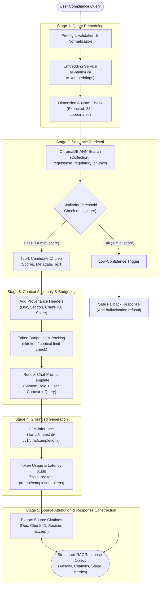

# RegulSense: End-to-End Query-to-Answer RAG Pipeline Flow Architecture

This document specifies the architectural lifecycle of a regulatory compliance inquiry traversing the **RegulSense RAG Pipeline**—from raw natural language query to grounded, cited LLM response.

---

## 1. High-Level Flow Overview

The RegulSense RAG pipeline is designed around **four decoupled, sequentially executed stages** with a terminal **source attribution** phase:



---

## 2. Detailed Breakdown of Pipeline Stages

### Stage 1: Query Embedding (`embed_query_stage`)
- **Purpose**: Map user natural language into a dense semantic vector space calibrated with the document corpus.
- **Input**: `query_text: str` (e.g. *"What is the mandatory timeframe for banks to report Severity 1 cyber security incidents to CERT-In and RBI?"*).
- **Processing**:
  1. Validates non-emptiness and strips whitespace.
  2. Issues an HTTP POST request to the embedding endpoint (`http://localhost:11434/v1/embeddings` or OpenAI compatible).
  3. Uses model `all-minilm` (dimension: 384).
  4. Verifies that the returned vector has exact coordinate length 384.
- **Output**: `QueryEmbedding` dataclass containing:
  - `query_text`: Normalized query.
  - `vector`: List of 384 floating-point coordinates.
  - `dimension`: 384.
  - `latency_seconds`: Wall-clock generation time.

---

### Stage 2: Semantic Retrieval (`retrieve_chunks_stage`)
- **Purpose**: Search the persistent ChromaDB collection (`regulsense_regulatory_chunks`) to locate the most relevant regulatory text segments.
- **Input**: `query_text: str`, `query_vector: List[float]`, `top_k: int = 3`, `min_score: Optional[float] = None`, `where_filter: Optional[Dict] = None`.
- **Processing**:
  1. Queries ChromaDB index using cosine similarity distance metric ($HNSW: \text{cosine}$).
  2. Converts raw distance to cosine similarity score: $\text{similarity} = 1.0 - \text{distance}$.
  3. Extracts chunk text and rich provenance metadata (`source_document`, `section`, `chunk_index`, `page_number`, `token_count`).
  4. Applies optional `min_score` cutoff to discard low-confidence noise chunks.
- **Output**: `List[RetrievedContextChunk]` ranked by descending similarity score.

---

### Stage 3: Grounded Context Assembly (`assemble_context_stage`)
- **Purpose**: Transform raw chunk text and metadata into an organized, citation-friendly context block while enforcing token budgets and guardrails.
- **Input**: `query: str`, `chunks: List[RetrievedContextChunk]`, `max_context_tokens: int = 2048`.
- **Processing**:
  1. Formats each chunk with explicit regulatory bounding markers:
     ```markdown
     [CHUNK {chunk_id}] | Source: {source_document} | Section: {section} | Relevance: {similarity_score:.4f}
     {document_text}
     ```
  2. Calculates cumulative token count using `tiktoken` (`cl100k_base` encoding).
  3. Truncates or omits lower-ranked chunks if context exceeds `max_context_tokens`.
  4. Renders standardized production prompts using `prompts/templates.py`:
     - **System Prompt**: Defines RegulSense role as Senior Banking Compliance Specialist with strict factual boundaries and anti-hallucination protocols.
     - **User Prompt**: Injects retrieved context block followed by the compliance question.
  5. If 0 chunks passed retrieval/filtering, injects a fallback message instructing the LLM to trigger standard out-of-scope refusal.
- **Output**: `AssembledContext` containing `formatted_messages`, `total_context_tokens`, `included_chunks`, and `was_truncated`.

---

### Stage 4: Grounded LLM Generation (`generate_answer_stage`)
- **Purpose**: Synthesize an accurate, factual compliance answer strictly grounded in the assembled regulatory context.
- **Input**: `messages: List[Dict[str, str]]`, `model: str = "llama3:latest"`, `temperature: float = 0.2`, `max_tokens: int = 500`.
- **Processing**:
  1. Issues a chat completion request to the OpenAI-compatible endpoint.
  2. Employs low temperature ($T=0.2$) to ensure deterministic, legally rigorous answers.
  3. Captures response completion text, token usage (`prompt_tokens`, `completion_tokens`, `total_tokens`), finish reason, and elapsed duration.
- **Output**: `GenerationResult` dataclass.

---

### Stage 5: Provenance & Source Attribution (`attribute_sources_stage`)
- **Purpose**: Provide full transparency and auditability for regulatory examiners by linking every generated answer to exact source circulars.
- **Input**: `chunks: List[RetrievedContextChunk]`, `excerpt_length: int = 200`.
- **Processing**:
  1. Extracts source document name, section title, chunk ID, and similarity score for each utilized chunk.
  2. Generates a clean text excerpt preview.
- **Output**: `List[SourceCitation]` attached to the final `RAGResponse`.

---

## 3. Data Contracts & Object Schema

```python
@dataclass
class RAGResponse:
    query: str
    answer: str
    citations: List[SourceCitation]
    metrics: PipelineStageMetrics
    assembled_context: AssembledContext
    raw_generation: GenerationResult
    timestamp: str
```

---

## 4. Resilience & Fallback Protocols

1. **Empty Query**: Pre-flight validation immediately raises `ValueError` before spending embedding API credits.
2. **Dimension Mismatch**: Embedding stage asserts vector length == 384, preventing ChromaDB dimension panics.
3. **Empty / Low-Scoring Retrieval**: When no chunks meet `min_score` (e.g. out-of-corpus query like Basel III capital adequacy), the assembler provides an explicit fallback context preventing hallucinated answers.
4. **LLM Connection Drop**: If the generation service is unreachable, a structured fallback `RAGResponse` is returned noting the connectivity failure rather than unhandled exception termination.
